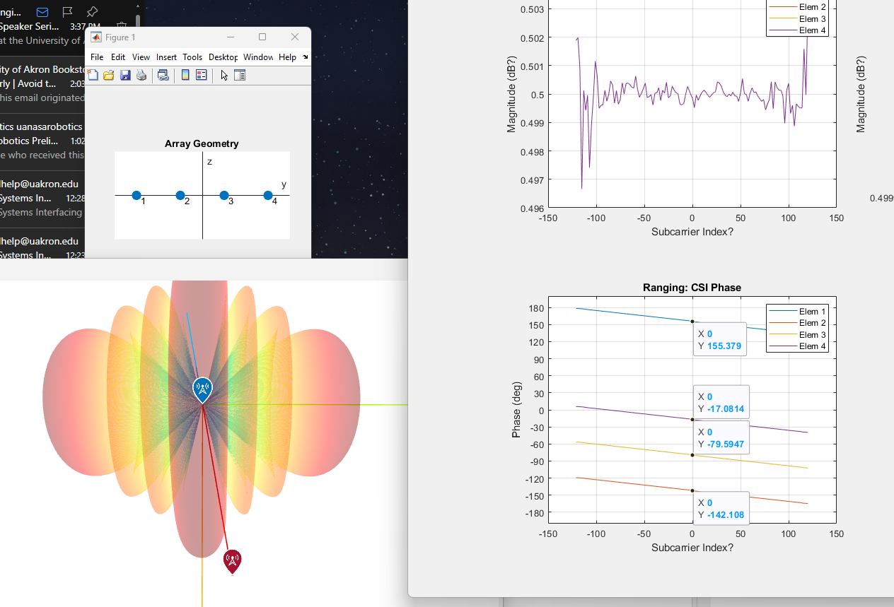

# Master Documentation
Welcome to the main documentation page! 
It's currently a little empty, but this is operating as a sort of devlog for the time being.

## `Selected MATLAB Examples`
This folder contains some examples that were useful to understand how to stand up the first iteration of the Digital Twin.
Of particular interest is the transmission of *real* information and the generation of *Channel State Information.*

`raytrace_MIMO_OFDM` generates, transmits, receives, and demodulates QAM-64 data. It also generates something shaped like Channel State Information from the Channel Impulse Response.

`positioning_802_11az` performs trilateration, using different Access Points to locate a Station. It sends a Null Data Packet (NDP), then uses it to both determine Round Trip Time / Time of Arrival and generate CSI, which is used to refine the ToA estimate.

`comb_pos_raytrace` is a combination of `raytrace_MIMO_OFDM` & `positioning_802_11az`. CSI generated by both examples is displayed side-by-side, with the left graph displaying the NDP-based CSI and the right displaying the Perfect-CIR-generated CSI.

The orientation of the array geometry can be a bit confusing. `comb_pos_raytrace` places the RX Array (Base Station) at the origin (without rotating it), and rotates the TX Array about it. The RX array is oriented such that elements 1 & 2 are along the negative Y axis, and elements 3 & 4 are along the positive Y axis. In turn, the model correctly predicts that the signal will first be received by Element 4, then 3, then 2, and finally 1. On the `Ranging: CSI Phase` plot, note that Element 1 is 'wrapped around,' as the Phase Range is limited to within [180, -180] -- a more useful assessment would subtract 360 degrees from Element 1's phase, but for the purposes of demonstration, this is sufficient. 